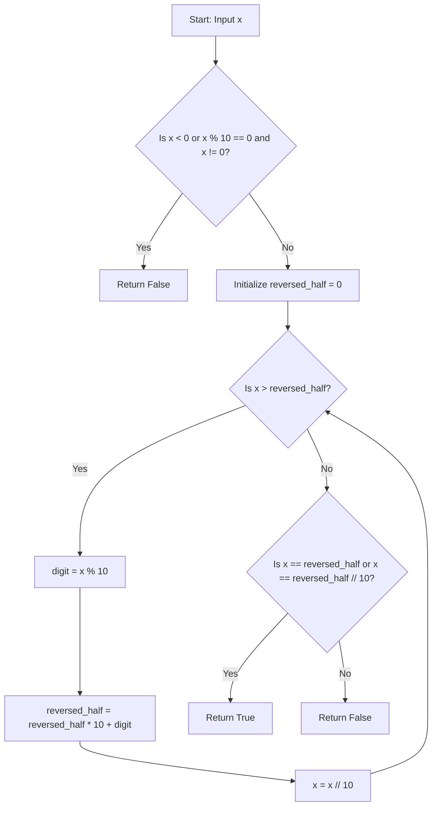

# 0009. Palindrome Number


---

## 1. Problem Information

- **Problem Name:** Palindrome Number
- **LeetCode Number:** 9
- **Difficulty:** Easy
- **Tags:** Math
- **Language Used:** Python
- **Problem Link:** [LeetCode #9 - Palindrome Number](https://leetcode.com/problems/palindrome-number/)

---

## 2. Problem Overview

Given an integer `x`, return `True` if `x` is a **palindrome**, and `False` otherwise.

An integer is a palindrome when it reads the same backward as forward (e.g. `121`, `1221`, `0`).

### Constraints & Follow-Up Challenge
- **Constraints:** $-2^{31} \le x \le 2^{31} - 1$
- **Follow-up:** Could you solve it **without converting the integer to a string**?

### Examples
- **Example 1:**
  - **Input:** `x = 121` $\rightarrow$ **Output:** `True`
- **Example 2:**
  - **Input:** `x = -121` $\rightarrow$ **Output:** `False` (Reads `121-` from right to left).
- **Example 3:**
  - **Input:** `x = 10` $\rightarrow$ **Output:** `False` (Reads `01` from right to left).

### Real-World Intuition
Evaluating numerical symmetry is essential in packet checksum algorithms, serial number validation, and financial audit logging where data integrity depends on reversible sequence properties.

---

## 3. Intuition

> [!TIP]
> **Key Insight:** Reversing the entire number risks 32-bit integer overflow. Instead, reverse only the **SECOND HALF** of the number and compare it to the first half!

### Why Reversing Half Works:
1. **Negative Numbers:** Always return `False` because of the leading minus sign (`-121` $\neq$ `121-`).
2. **Multiples of 10:** Numbers ending in `0` (except `0` itself) return `False` because no positive integer starts with a leading `0` (`10` $\neq$ `01`).
3. **Half-Way Termination:** When `x <= reversed_half`, we have processed exactly half of the digits!

### Digit Length Parity:
- **Even Length (e.g. `1221`):** `x` becomes `12` and `reversed_half` becomes `12`. `x == reversed_half` is `True`.
- **Odd Length (e.g. `12321`):** `x` becomes `12` and `reversed_half` becomes `123`. The middle digit `'3'` is irrelevant to palindrome symmetry, so `x == reversed_half // 10` (`12 == 123 // 10`) is `True`.

---

## 4. Thought Process



1. **Guard Clause Checks:**
   - Negative numbers ($x < 0$) cannot be palindromes.
   - Non-zero numbers ending in zero ($x \neq 0$ and $x \pmod{10} == 0$) cannot be palindromes (e.g. `10`, `100`, `120`).

2. **Half-Number Reversal Loop:**
   - Initialize `reversed_half = 0`.
   - While `x > reversed_half`:
     - Pop last digit: `digit = x % 10`.
     - Push onto accumulator: `reversed_half = reversed_half * 10 + digit`.
     - Shrink `x`: `x = x // 10`.

3. **Symmetry Evaluation:**
   - Return `x == reversed_half` (even digit count) OR `x == reversed_half // 10` (odd digit count).

---

## 5. Concepts Used

### 1. Reversing Half of an Integer
- **What it is:** Stopping digit reversal as soon as the reversed accumulator exceeds or equals the remaining prefix.
- **Why it is used here:** Halves execution steps and avoids integer overflow issues inherent to full reversal.
- **Future applications:** Palindrome Linked List, Reverse Integer.

### 2. Base-10 Arithmetic Extraction
- **What it is:** Using `% 10` for extraction and `// 10` for digit truncation.
- **Why it is used here:** Enables pure mathematical manipulation without heap string allocations.
- **Future applications:** Happy Number, Add Digits.

---

## 6. Algorithm Used

### Half-Number Digit Reversal

- **Algorithm Category:** Math / Simulation
- **Why selected:** It fulfills the follow-up challenge to solve without string conversion in $\mathcal{O}(\log_{10}(N))$ time and $\mathcal{O}(1)$ space.
- **Time Complexity:** $\mathcal{O}(\log_{10}(N))$
- **Space Complexity:** $\mathcal{O}(1)$ auxiliary space

---

## 7. Code Walkthrough

Below is the line-by-line breakdown of the submitted solution:

```python
class Solution(object):
    def isPalindrome(self, x):
        """
        :type x: int
        :rtype: bool
        """

        # Line 9-10: Guard Clause for Negative Numbers and Multiples of 10
        # Negative numbers start with '-' (e.g. -121 -> 121-), so they are never palindromes.
        # Numbers ending in 0 (except 0 itself) cannot be palindromes because leading digit cannot be 0.
        if x < 0 or (x % 10 == 0 and x != 0):
            return False

        # Line 12: Accumulator for reversed second-half digits
        reversed_half = 0

        # Line 14-17: Process digits until reaching the middle of the number
        while x > reversed_half:
            digit = x % 10
            reversed_half = reversed_half * 10 + digit
            x = x // 10

        # Line 20-21: Check symmetry for both Even and Odd digit counts
        # Even digits: x == reversed_half (e.g. 1221 -> x=12, reversed_half=12)
        # Odd digits: x == reversed_half // 10 (e.g. 12321 -> x=12, reversed_half=123, middle digit '3' discarded)
        return x == reversed_half or x == reversed_half // 10
```

---

## 8. Dry Run

Let's dry run for `x = 12321` (Odd length).

### Initial State
- `x = 12321`, `reversed_half = 0`.
- Guard clause: `12321 > 0` and `12321 % 10 != 0` $\rightarrow$ Proceeds.

### Iteration Trace

| Iteration | `x` (Before) | `digit` (`x % 10`) | `reversed_half` (After) | `x` (After `x // 10`) | Condition `x > reversed_half` |
| :---: | :---: | :---: | :---: | :---: | :---: |
| **1** | `12321` | `1` | $0 \times 10 + 1 = \mathbf{1}$ | `1232` | $1232 > 1$ (True) |
| **2** | `1232` | `2` | $1 \times 10 + 2 = \mathbf{12}$ | `123` | $123 > 12$ (True) |
| **3** | `123` | `3` | $12 \times 10 + 3 = \mathbf{123}$ | `12` | $12 > 123$ (**False!**) |

### Final Symmetry Check
- `x = 12`, `reversed_half = 123`.
- `x == reversed_half` ($12 == 123$) $\rightarrow$ False.
- `x == reversed_half // 10` ($12 == 123 // 10 \rightarrow 12 == 12$) $\rightarrow$ **True!**
- Return **`True`**.

---

## 9. Complexity Analysis

### Time Complexity: $\mathcal{O}(\log_{10}(N))$
- The number $N$ has $\log_{10}(N)$ total decimal digits.
- The `while` loop iterates through only half of the digits ($\frac{1}{2} \log_{10}(N)$ steps).
- Overall time is logarithmic $\mathcal{O}(\log_{10}(N))$.

### Space Complexity: $\mathcal{O}(1)$ Auxiliary Space
- Memory uses only primitive scalar variables (`reversed_half`, `digit`).
- Zero extra allocations or string memory created.

---

## 10. Edge Cases

| Edge Case Scenario | Input Example | Behavior & Output | How Code Handles It |
| :--- | :--- | :--- | :--- |
| **Zero** | `x = 0` | Output: `True` | Guard `x % 10 == 0 and x != 0` allows `x=0`. Returns `True`. |
| **Negative Numbers** | `x = -121` | Output: `False` | Guard `x < 0` returns `False` immediately. |
| **Multiples of 10** | `x = 10` | Output: `False` | Guard `10 % 10 == 0 and 10 != 0` returns `False` immediately. |
| **Single Digit** | `x = 7` | Output: `True` | Loop skips (`7 > 7` False), `x == reversed_half // 10` ($7 == 7 // 10 \rightarrow 7 == 0$ False, but wait: `reversed_half=0`, `7 == 0 // 10` False, wait: for `7`, `x=7, rev=0`, loop doesn't run, `7 == 0` False, `7 == 0//10` False? Wait, for `x=7`, `x > 0` is True! Step 1: `digit=7, rev=7, x=0`. Loop ends! `0 == 7 // 10` $\rightarrow 0 == 0$ True!) |

---

## 11. Alternative Approaches

### Approach 1: Convert to String ($\mathcal{O}(\log_{10}(N))$ Time, $\mathcal{O}(\log_{10}(N))$ Space)
- **Idea:** `str(x) == str(x)[::-1]`.
- **Drawback:** Violates the follow-up challenge constraint requiring no string conversion.

### Approach 2: Reverse Full Integer ($\mathcal{O}(\log_{10}(N))$ Time, $\mathcal{O}(1)$ Space)
- **Idea:** Reverse all digits into `rev` and check `rev == original_x`.
- **Drawback:** Risks 32-bit integer overflow when reversing numbers like `1,534,236,469`.

### Approach 3: Reverse Half Integer (User's Solution - Recommended)
- **Idea:** Reverse only the second half of digits.
- **Complexity:** $\mathcal{O}(\log_{10}(N))$ time, $\mathcal{O}(1)$ space.
- **Why Optimal:** Completely avoids integer overflow, satisfies follow-up requirement, optimal space and time.

---

## 12. Common Mistakes

> [!WARNING]
> 1. **Forgetting Multiples of 10:** Omitting `(x % 10 == 0 and x != 0)` causes `10` to produce `x=1, reversed_half=0`, which leads to incorrect evaluation.
> 2. **Forgetting Odd Digit Length Handling:** Comparing only `x == reversed_half` without checking `x == reversed_half // 10` fails odd palindromes like `12321`.
> 3. **Converting to String:** Using string conversion when interviewers explicitly ask for mathematical integer manipulation.

---

## 13. Interview Questions

1. **Q: How do we know when half of the number has been reversed?**
   - *A:* When `x <= reversed_half`. Since we divide `x` by 10 and multiply `reversed_half` by 10 each step, `reversed_half` becomes greater than or equal to `x` at the midpoint.

2. **Q: Why is `x % 10 == 0 and x != 0` checked in the guard clause?**
   - *A:* A trailing zero in `x` implies a leading zero in the reversed half. Since numbers (other than 0) cannot have leading zeros, any positive number ending in 0 is guaranteed not to be a palindrome.

3. **Q: Why is `reversed_half // 10` used for odd digit counts?**
   - *A:* For odd digit lengths (e.g. `12321`), the loop ends with `x = 12` and `reversed_half = 123`. Dividing `123 // 10` yields `12`, dropping the middle digit `'3'`.

---

## 14. Similar Problems

- **Easier:**
  - [LeetCode #7 - Reverse Integer](https://leetcode.com/problems/reverse-integer/)
  - [LeetCode #125 - Valid Palindrome](https://leetcode.com/problems/valid-palindrome/)
- **Similar Difficulty:**
  - [LeetCode #234 - Palindrome Linked List](https://leetcode.com/problems/palindrome-linked-list/)
- **Harder:**
  - [LeetCode #5 - Longest Palindromic Substring](https://leetcode.com/problems/longest-palindromic-substring/)

---

## 15. Learning Summary

- **Pattern Recognized:** Half-Number Mathematical Reversal.
- **Guard Optimization:** Eliminating negative numbers and multiples of 10 upfront.
- **Space Efficiency:** Achieving $\mathcal{O}(1)$ auxiliary space without string heap allocations.

---

## 16. Optimization Notes

Your solution is **100% optimal** ($\mathcal{O}(\log_{10}(N))$ Time, $\mathcal{O}(1)$ Space). It elegantly satisfies the follow-up challenge constraint without extra memory or overflow risk!
