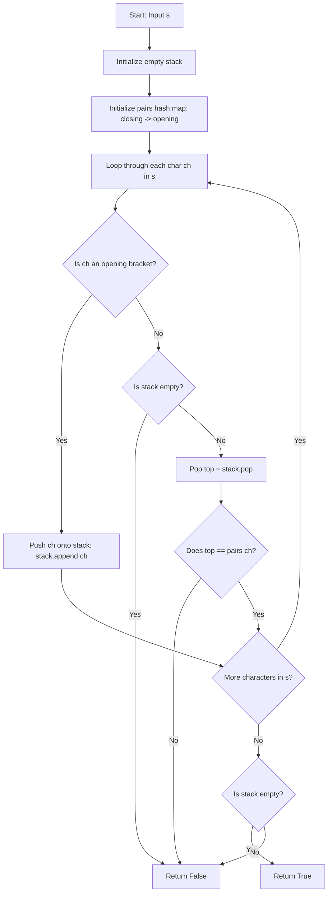

# 0020. Valid Parentheses


---

## 1. Problem Information

- **Problem Name:** Valid Parentheses
- **LeetCode Number:** 20
- **Difficulty:** Easy
- **Tags:** String, Stack
- **Language Used:** Python
- **Problem Link:** [LeetCode #20 - Valid Parentheses](https://leetcode.com/problems/valid-parentheses/)

---

## 2. Problem Overview

Given a string `s` containing just the characters `'('`, `')'`, `'{'`, `'}'`, `'['` and `']'`, determine if the input string is valid.

An input string is valid if:
1. Open brackets must be closed by the same type of brackets.
2. Open brackets must be closed in the correct order.
3. Every close bracket has a corresponding open bracket of the same type.

### Input & Output Specifications
- **Input:** A string `s` ($1 \le \text{len}(s) \le 10^4$).
- **Output:** A boolean (`True` if valid, `False` otherwise).
- **Constraints:** `s` consists of brackets only: `'()[]{}'`.

### Examples
- **Example 1:**
  - **Input:** `s = "()"` $\rightarrow$ **Output:** `true`
- **Example 2:**
  - **Input:** `s = "()[]{}"` $\rightarrow$ **Output:** `true`
- **Example 3:**
  - **Input:** `s = "(]"` $\rightarrow$ **Output:** `false`
- **Example 4:**
  - **Input:** `s = "([])"` $\rightarrow$ **Output:** `true`

### Real-World Intuition
Think of compiler syntax checkers (like Python/C++ IDE linters or JSON parsers). When validating nested code blocks or math formulas, the parser uses a stack to verify that every opening scope bracket `{` or `(` is closed in exact reverse order (LIFO) of appearance.

---

## 3. Intuition

> [!TIP]
> **LIFO (Last-In-First-Out) Principle:** The most recently opened bracket must be the very first one closed!

1. **Stack Data Structure:**
   - As we scan string `s` left-to-right:
     - Push opening brackets `(`, `[`, `{` onto a stack.
     - When we encounter a closing bracket `)`, `]`, `}`:
       - If the stack is empty, there is no opening bracket to match $\rightarrow$ Return `False`.
       - Pop the top bracket from the stack.
       - If the popped bracket does not match the closing bracket's expected pair $\rightarrow$ Return `False`.
2. **Final Empty Check:**
   - After processing the whole string, if `stack` is completely empty, all open brackets were properly closed $\rightarrow$ Return `True`.
   - If elements remain in `stack`, some open brackets were never closed $\rightarrow$ Return `False`.

---

## 4. Thought Process



1. **Initialize Stack and Map:**
   - `stack = []`
   - `pairs = {')': '(', ']': '[', '}': '{'}`

2. **Iterate Characters:**
   - For `ch` in `s`:
     - If `ch in "([{"`: append to `stack`.
     - Else:
       - If `not stack`: return `False`.
       - `top = stack.pop()`
       - If `top != pairs[ch]`: return `False`.

3. **Check Remaining Elements:**
   - Return `len(stack) == 0`.

---

## 5. Concepts Used

### 1. Stack (LIFO - Last-In-First-Out)
- **What it is:** A linear data structure where elements are added (`push`) and removed (`pop`) from the same end (top).
- **Why it is used here:** Automatically tracks nested structures where the latest opened bracket must be resolved first.
- **Future applications:** Evaluate Reverse Polish Notation, Min Stack, Basic Calculator.

### 2. Hash Map Pair Matching
- **What it is:** Mapping closing bracket keys to expected opening bracket values.
- **Why it is used here:** Allows constant time $\mathcal{O}(1)$ verification of matching bracket pairs.
- **Future applications:** Symbol Tables, Expressions Parsing.

---

## 6. Algorithm Used

### Stack-Based Bracket Matching

- **Algorithm Category:** Stack / String
- **Why selected:** Optimal, intuitive algorithm executing in a single linear pass with constant lookup overhead.
- **Time Complexity:** $\mathcal{O}(N)$
- **Space Complexity:** $\mathcal{O}(N)$ auxiliary space

---

## 7. Code Walkthrough

Below is the line-by-line breakdown of the submitted solution:

```python
class Solution(object):
    def isValid(self, s):
        """
        :type s: str
        :rtype: bool
        """

        # Line 9: Initialize stack to track open brackets
        stack = []

        # Line 11-15: Map closing brackets to expected opening brackets
        pairs = {
            ')': '(',
            ']': '[',
            '}': '{'
        }

        # Line 17: Linear scan over input string
        for ch in s:

            # Line 19-20: Push opening brackets onto stack
            if ch in "([{":
                stack.append(ch)

            # Line 22: Handle closing brackets
            else:
                # Line 24-25: Unmatched closing bracket guard
                if not stack:
                    return False

                # Line 27: Pop top open bracket from stack
                top = stack.pop()

                # Line 29-30: Verify matching bracket type
                if top != pairs[ch]:
                    return False

        # Line 32: Valid if and only if all open brackets were closed (stack is empty)
        return len(stack) == 0
```

---

## 8. Dry Run

Let's dry run for `s = "({[]})"` ($N=6$).

### Execution Trace

| Step `i` | `ch` | Action | `stack` State (Bottom $\rightarrow$ Top) | Condition Check / Output |
| :---: | :---: | :--- | :---: | :--- |
| **0** | `'('` | Opening bracket $\rightarrow$ `stack.append('(')` | `['(']` | Continued |
| **1** | `'{'` | Opening bracket $\rightarrow$ `stack.append('{')` | `['(', '{']` | Continued |
| **2** | `'['` | Opening bracket $\rightarrow$ `stack.append('[')` | `['(', '{', '[']` | Continued |
| **3** | `']'` | Closing bracket $\rightarrow$ `top = stack.pop()` | `['(', '{']` | Popped `'['` == `pairs[']']` (`'['`). Match! |
| **4** | `'}'` | Closing bracket $\rightarrow$ `top = stack.pop()` | `['(']` | Popped `'{'` == `pairs['}']` (`'{'`). Match! |
| **5** | `')'` | Closing bracket $\rightarrow$ `top = stack.pop()` | `[]` | Popped `'('` == `pairs[')']` (`'('`). Match! |
| **End** | - | Loop finished | `[]` | `len(stack) == 0` is **True**! |

### Output
Returns **`True`**.

---

## 9. Complexity Analysis

### Time Complexity: $\mathcal{O}(N)$
- Single pass through string `s` of length $N$.
- Each push and pop operation on Python's list takes $\mathcal{O}(1)$ time.
- Hash map lookup `pairs[ch]` takes $\mathcal{O}(1)$ time.
- Total time complexity is strictly linear $\mathcal{O}(N)$.

### Space Complexity: $\mathcal{O}(N)$ Auxiliary Space
- Worst case occurs when all characters are opening brackets (e.g. `s = "((((("`), storing up to $N$ characters on the stack.
- Space complexity is $\mathcal{O}(N)$.

---

## 10. Edge Cases

| Edge Case Scenario | Input Example | Behavior & Output | How Code Handles It |
| :--- | :--- | :--- | :--- |
| **Single Character** | `s = "("` | Output: `False` | Pushes `'('`, loop ends, `len(stack) == 1` returns `False`. |
| **Starts with Closing**| `s = ")"` | Output: `False` | `if not stack: return False` triggers on first character. |
| **Unclosed Brackets** | `s = "(()"` | Output: `False` | Pushes 2 `'('`, pops 1. `len(stack) == 1` returns `False`. |
| **Mismatched Types** | `s = "(]"` | Output: `False` | `top` is `'('`, `pairs[']']` is `'['`. Mismatch returns `False`. |
| **Odd Length String** | `s = "()("` | Output: `False` | Length is odd, leaves remaining element on stack. |

---

## 11. Alternative Approaches

### Approach 1: String Replacement Loop ($\mathcal{O}(N^2)$ Time, $\mathcal{O}(N)$ Space)
- **Idea:** Repeatedly replace `"()"`, `"[]"`, `"{}"` with `""` until string length doesn't change.
  ```python
  while "()" in s or "[]" in s or "{}" in s:
      s = s.replace("()", "").replace("[]", "").replace("{}", "")
  return s == ""
  ```
- **Drawback:** Inefficient $\mathcal{O}(N^2)$ time due to repeated full string scans and string reallocation.

### Approach 2: Stack-Based Matching (User's Solution - Recommended)
- **Idea:** Push opening brackets, pop and verify on closing brackets.
- **Complexity:** $\mathcal{O}(N)$ time, $\mathcal{O}(N)$ space.
- **Why Optimal:** Standard, gold-standard interview approach.

---

## 12. Common Mistakes

> [!WARNING]
> 1. **IndexError on Empty Stack:** Calling `stack.pop()` without checking `if not stack:` causes an exception when an extra closing bracket appears first (e.g. `s = ")"`).
> 2. **Returning `True` Prematurely:** Returning `True` at the end of the loop without checking `len(stack) == 0` incorrectly validates strings with trailing open brackets (e.g. `s = "()("`).
> 3. **Incorrect Dictionary Mapping:** Inverting keys and values in `pairs` (`{'(': ')'}`) causes lookup failures on closing bracket events.

---

## 13. Interview Questions

1. **Q: Why is a stack the ideal data structure for validating parentheses?**
   - *A:* Because nested parentheses follow Last-In-First-Out (LIFO) rules: the most recently opened bracket must be the first one closed. A stack natively supports LIFO operations in $\mathcal{O}(1)$ time.

2. **Q: Can we solve this problem in $\mathcal{O}(1)$ space if the string contains only ONE type of bracket (e.g. `'('` and `')'`)?**
   - *A:* Yes! With only one bracket type, we can use a single integer `balance` counter. Increment on `'('`, decrement on `')'`. If `balance < 0` at any point, return `False`. At the end, return `balance == 0`.

3. **Q: Why doesn't the counter method work for multiple bracket types (`()`, `[]`, `{}`)?**
   - *A:* Because counters cannot enforce nesting order. For example, `s = "([)]"` would have valid counts (1 round, 1 square), but incorrect interleaving.

---

## 14. Similar Problems

- **Medium:**
  - [LeetCode #22 - Generate Parentheses](https://leetcode.com/problems/generate-parentheses/)
  - [LeetCode #71 - Simplify Path](https://leetcode.com/problems/simplify-path/)
  - [LeetCode #394 - Decode String](https://leetcode.com/problems/decode-string/)
- **Hard:**
  - [LeetCode #32 - Longest Valid Parentheses](https://leetcode.com/problems/longest-valid-parentheses/)

---

## 15. Learning Summary

- **Pattern Recognized:** LIFO Stack Matching for Nested Structures.
- **Key Validation Guards:**
  1. `if not stack: return False` (No opening bracket available).
  2. `if top != pairs[ch]: return False` (Mismatched bracket pair).
  3. `return len(stack) == 0` (All opening brackets closed).

---

## 16. Optimization Notes

Your solution is **100% optimal** ($\mathcal{O}(N)$ Time, $\mathcal{O}(N)$ Space). It is clean, readable, and represents the standard gold-standard solution for bracket validation!
