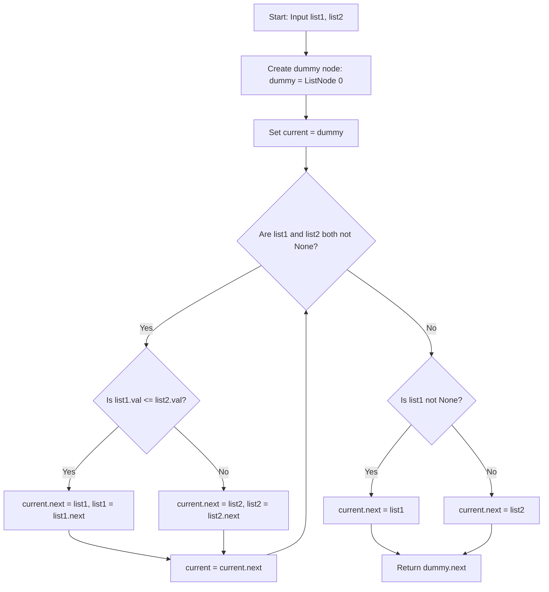

# 0021. Merge Two Sorted Lists


---

## 1. Problem Information

- **Problem Name:** Merge Two Sorted Lists
- **LeetCode Number:** 21
- **Difficulty:** Easy
- **Tags:** Linked List, Two Pointers, Recursion
- **Language Used:** Python
- **Problem Link:** [LeetCode #21 - Merge Two Sorted Lists](https://leetcode.com/problems/merge-two-sorted-lists/)

---

## 2. Problem Overview

You are given the heads of two sorted linked lists `list1` and `list2`.

Merge the two lists into one **sorted** linked list. The list should be made by **splicing together** the nodes of the first two lists.

Return the head of the merged linked list.

### Input & Output Specifications
- **Input:**
  - `list1`: Head of a sorted singly-linked list ($0 \le \text{len} \le 50$).
  - `list2`: Head of a sorted singly-linked list ($0 \le \text{len} \le 50$).
- **Output:** Head of the merged sorted singly-linked list.
- **Constraints:** $-100 \le \text{Node.val} \le 100$, both input lists are sorted in non-decreasing order.

### Examples
- **Example 1:**
  - **Input:** `list1 = [1,2,4]`, `list2 = [1,3,4]`
  - **Output:** `[1,1,2,3,4,4]`
- **Example 2:**
  - **Input:** `list1 = []`, `list2 = []` $\rightarrow$ **Output:** `[]`
- **Example 3:**
  - **Input:** `list1 = []`, `list2 = [0]` $\rightarrow$ **Output:** `[0]`

### Real-World Intuition
Imagine a database engine performing a **Sort-Merge Join** or merging two sorted log streams (like git commit logs from two separate branches) into a single chronological feed. By inspecting only the front element of each stream, we can merge them in linear time without re-sorting!

---

## 3. Intuition

> [!TIP]
> **Two Pointers Splicing:** Compare the front nodes of `list1` and `list2`. Re-link `current.next` to point to the smaller node, advance that list's pointer, and repeat!

1. **Dummy Head Node:**
   - Create a `dummy = ListNode(0)` node and a tail pointer `current = dummy`.
   - `dummy` eliminates special-case logic for initializing the merged list's head node.
2. **Iterative Comparison Loop:**
   - While `list1` and `list2` are both not `None`:
     - If `list1.val <= list2.val`: attach `list1` to `current.next`, then advance `list1 = list1.next`.
     - Else: attach `list2` to `current.next`, then advance `list2 = list2.next`.
     - Advance `current = current.next`.
3. **Attach Remaining Nodes:**
   - When one list runs out of elements, attach the entire remaining non-empty list directly: `current.next = list1 if list1 else list2`.
   - Return `dummy.next`.

---

## 4. Thought Process



1. **Initialize Sentinel Node:**
   - `dummy = ListNode(0)`, `current = dummy`.

2. **Parallel Traversal:**
   - Loop `while list1 and list2:`
     - Compare `list1.val <= list2.val`.
     - Splice the smaller node into `current.next`.
     - Move the corresponding pointer forward.
     - Move `current = current.next`.

3. **Attach Remaining Chain:**
   - `if list1: current.next = list1`
   - `else: current.next = list2`

4. **Return Head:**
   - Return `dummy.next`.

---

## 5. Concepts Used

### 1. In-Place Pointer Re-linking (Node Splicing)
- **What it is:** Modifying existing `next` pointer references of nodes rather than instantiating new objects.
- **Why it is used here:** Guarantees optimal $\mathcal{O}(1)$ auxiliary space complexity.
- **Future applications:** Reorder List, Partition List, Reverse Nodes in k-Group.

### 2. Sentinel / Dummy Head Pattern
- **What it is:** Using an artificial starting node to serve as a fixed anchor.
- **Why it is used here:** Avoids duplicate `if head is None` checks during list construction.
- **Future applications:** Add Two Numbers, Remove Nth Node From End.

---

## 6. Algorithm Used

### Iterative Two-Pointer Merging

- **Algorithm Category:** Linked List / Two Pointers
- **Why selected:** Optimal $\mathcal{O}(N + M)$ runtime with $\mathcal{O}(1)$ auxiliary memory and no recursion call stack overhead.
- **Time Complexity:** $\mathcal{O}(N + M)$
- **Space Complexity:** $\mathcal{O}(1)$ auxiliary space

---

## 7. Code Walkthrough

Below is the line-by-line breakdown of the submitted solution:

```python
# Definition for singly-linked list.
# class ListNode(object):
#     def __init__(self, val=0, next=None):
#         self.val = val
#         self.next = next

class Solution(object):
    def mergeTwoLists(self, list1, list2):
        """
        :type list1: Optional[ListNode]
        :type list2: Optional[ListNode]
        :rtype: Optional[ListNode]
        """

        # Line 15-16: Initialize dummy sentinel node and tail pointer
        dummy = ListNode(0)
        current = dummy

        # Line 18: Loop while both lists contain elements
        while list1 and list2:

            # Line 20-22: list1 has smaller or equal value -> splice list1 node
            if list1.val <= list2.val:
                current.next = list1
                list1 = list1.next
            # Line 23-25: list2 has smaller value -> splice list2 node
            else:
                current.next = list2
                list2 = list2.next

            # Line 27: Advance tail pointer of merged list
            current = current.next

        # Line 29-32: Attach remaining non-empty list chain
        if list1:
            current.next = list1
        else:
            current.next = list2

        # Line 34: Return head of merged list (skipping dummy sentinel)
        return dummy.next
```

---

## 8. Dry Run

Let's dry run for `list1 = [1, 2, 4]` and `list2 = [1, 3, 4]`.

### Execution Trace

| Step | `list1` Val | `list2` Val | Comparison (`l1 <= l2`) | Spliced Node | `current.next` Points To | Next State |
| :---: | :---: | :---: | :---: | :---: | :---: | :--- |
| **0** | `1` | `1` | $1 \le 1$ (**True**) | `list1` (`1`) | `ListNode(1)` | `list1` moves to `2` |
| **1** | `2` | `1` | $2 \le 1$ (False) | `list2` (`1`) | `ListNode(1)` | `list2` moves to `3` |
| **2** | `2` | `3` | $2 \le 3$ (**True**) | `list1` (`2`) | `ListNode(2)` | `list1` moves to `4` |
| **3** | `4` | `3` | $4 \le 3$ (False) | `list2` (`3`) | `ListNode(3)` | `list2` moves to `4` |
| **4** | `4` | `4` | $4 \le 4$ (**True**) | `list1` (`4`) | `ListNode(4)` | `list1` becomes `None` |
| **End**| `None` | `4` | Loop ends | `current.next = list2` | `[4]` attached | Merged list complete! |

### Output
Returns `dummy.next` $\rightarrow$ **`[1, 1, 2, 3, 4, 4]`**.

---

## 9. Complexity Analysis

### Time Complexity: $\mathcal{O}(N + M)$
- Where $N$ is the number of nodes in `list1` and $M$ is the number of nodes in `list2`.
- At each iteration of the `while` loop, exactly one pointer (`list1` or `list2`) is advanced by 1 node.
- Total iterations bounded by $N + M \Rightarrow \mathcal{O}(N + M)$ time.

### Space Complexity: $\mathcal{O}(1)$ Auxiliary Space
- The nodes are re-linked in-place.
- Uses only 2 pointer variables (`dummy` and `current`).
- Memory allocation is $\mathcal{O}(1)$ constant auxiliary space.

---

## 10. Edge Cases

| Edge Case Scenario | Input Example | Behavior & Output | How Code Handles It |
| :--- | :--- | :--- | :--- |
| **Both Lists Empty** | `list1 = []`, `list2 = []` | Output: `[]` | `while` loop doesn't run, `current.next = list2` (`None`), returns `dummy.next` (`None`). |
| **One List Empty** | `list1 = []`, `list2 = [0]` | Output: `[0]` | `while` loop doesn't run, `current.next = list2` (`[0]`), returns `[0]`. |
| **Disjoint Ranges** | `list1 = [1, 2]`, `list2 = [3, 4]`| Output: `[1, 2, 3, 4]` | Merges `list1` completely first, then appends remaining `list2` chain. |
| **All Duplicates** | `list1 = [1, 1]`, `list2 = [1, 1]`| Output: `[1, 1, 1, 1]` | Operates smoothly preserving stable order (`<=`). |

---

## 11. Alternative Approaches

### Approach 1: Recursive Merging ($\mathcal{O}(N + M)$ Time, $\mathcal{O}(N + M)$ Space)
- **Idea:** Recursively pick the smaller head node and assign `smaller.next = mergeTwoLists(smaller.next, other)`.
  ```python
  if not list1: return list2
  if not list2: return list1
  if list1.val <= list2.val:
      list1.next = self.mergeTwoLists(list1.next, list2)
      return list1
  else:
      list2.next = self.mergeTwoLists(list1, list2.next)
      return list2
  ```
- **Drawback:** Requires $\mathcal{O}(N + M)$ recursion call stack memory overhead.

### Approach 2: Iterative Two-Pointer Merging (User's Solution - Recommended)
- **Idea:** Compare nodes with 2 pointers, splice in-place, use dummy node.
- **Complexity:** $\mathcal{O}(N + M)$ time, $\mathcal{O}(1)$ space.
- **Why Optimal:** Standard interview blueprint; optimal time & space with zero call stack overhead.

---

## 12. Common Mistakes

> [!WARNING]
> 1. **Allocating New Nodes:** Creating `ListNode(val)` inside the loop instead of re-linking existing nodes in-place (wastes memory and violates pointer splicing intent).
> 2. **Forgetting to Attach Remaining List:** Omitting the `if list1: current.next = list1 else: current.next = list2` step causes the tail of the longer list to be dropped.
> 3. **Using `or` Instead of `and` in Loop Condition:** Writing `while list1 or list2:` causes `AttributeError: 'NoneType' object has no attribute 'val'` when one list exhausts early.

---

## 13. Interview Questions

1. **Q: Why is iterative merging preferred over recursive merging in production systems?**
   - *A:* Iterative merging uses $\mathcal{O}(1)$ space, whereas recursive merging uses $\mathcal{O}(N + M)$ call stack space which can cause stack overflow exceptions for long lists.

2. **Q: How would you extend this algorithm to merge $K$ sorted linked lists (LeetCode #23)?**
   - *A:* Use a Min-Heap (Priority Queue) containing the current head nodes of all $K$ lists. Extract min in $\mathcal{O}(\log K)$ time, attach to merged list, and push `min_node.next`. Total time: $\mathcal{O}(N \log K)$.

3. **Q: Is the merging process stable?**
   - *A:* Yes! Using `if list1.val <= list2.val:` guarantees that when elements are equal, `list1`'s element precedes `list2`'s element, maintaining stability.

---

## 14. Similar Problems

- **Easy:**
  - [LeetCode #88 - Merge Sorted Array](https://leetcode.com/problems/merge-sorted-array/)
- **Medium:**
  - [LeetCode #148 - Sort List](https://leetcode.com/problems/sort-list/)
- **Hard:**
  - [LeetCode #23 - Merge k Sorted Lists](https://leetcode.com/problems/merge-k-sorted-lists/)

---

## 15. Learning Summary

- **Pattern Recognized:** Iterative Two-Pointer Node Splicing.
- **Sentinel Advantage:** Dummy head `dummy = ListNode(0)` simplifies initial link assignments.
- **In-Place Efficiency:** Re-linking `next` pointers preserves $\mathcal{O}(1)$ space complexity.

---

## 16. Optimization Notes

Your solution is **100% optimal** ($\mathcal{O}(N + M)$ Time, $\mathcal{O}(1)$ Auxiliary Space). It is clean, elegant, and represents the gold-standard interview implementation!
