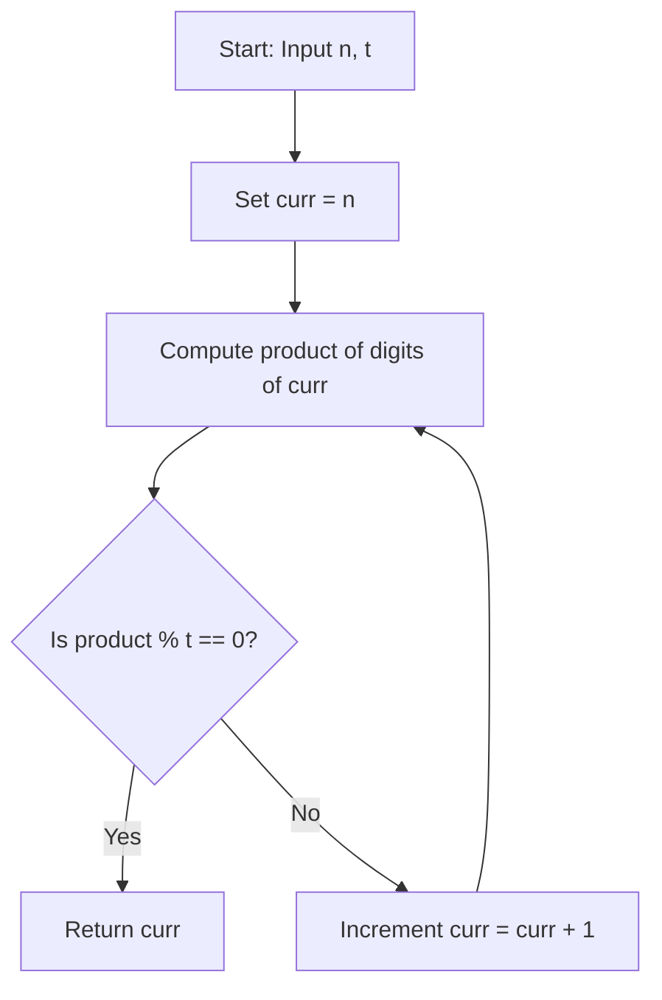

# 3345. Smallest Divisible Digit Product I


---

## 1. Problem Information

- **Problem Name:** Smallest Divisible Digit Product I
- **LeetCode Number:** 3345
- **Difficulty:** Easy
- **Tags:** Math, Simulation
- **Language Used:** Python
- **Problem Link:** [LeetCode #3345 - Smallest Divisible Digit Product I](https://leetcode.com/problems/smallest-divisible-digit-product-i/)

---

## 2. Problem Overview

You are given two integers `n` and `t`. Return the smallest number greater than or equal to `n` such that the **product of its digits** is divisible by `t`.

### Input & Output Specifications
- **Input:**
  - `n`: Starting integer ($1 \le n \le 100$).
  - `t`: Target divisor integer ($1 \le t \le 10$).
- **Output:** Smallest integer $\ge n$ whose digit product is divisible by `t`.

### Examples
- **Example 1:**
  - **Input:** `n = 10, t = 2`
  - **Output:** `10`
  - **Explanation:** The digit product of 10 is $1 \times 0 = 0$. $0$ is divisible by 2 ($0 \pmod 2 = 0$).
- **Example 2:**
  - **Input:** `n = 15, t = 3`
  - **Output:** `16`
  - **Explanation:** The digit product of 16 is $1 \times 6 = 6$. $6$ is divisible by 3 ($6 \pmod 3 = 0$).

### Real-World Intuition
Imagine a checksum validator for serial codes. To ensure a serial number starting at $N$ passes validation, the system computes the digital product of its numbers until it finds the first number divisible by key $T$.

---

## 3. Intuition

> [!TIP]
> **Constant Search Property:** Any number containing digit `'0'` (e.g. 10, 20, 30...) has a digit product of $0$. Since $0 \pmod t == 0$ for all $t$, a valid number exists within at most **10 increments** from $n$!

### Why Linear Search is $\mathcal{O}(1)$:
- In any 10 consecutive integers, at least one number ends in digit `0`.
- The product of digits of any number ending in `0` is $0$.
- Zero is divisible by any integer $t \in [1, 10]$.
- Therefore, starting at `n`, the search loop will run at most 10 times!

---

## 4. Thought Process



1. **Helper Function `get_digit_product(num)`:**
   - Multiply every digit of `num` together.

2. **Linear Search Loop:**
   - Set `curr = n`.
   - While `True`:
     - Calculate digit product of `curr`.
     - If product $\pmod t == 0$, return `curr`.
     - Else `curr += 1`.

---

## 5. Concepts Used

### 1. Constant-Bounded Search Space
- **What it is:** A search loop whose maximum iterations are mathematically guaranteed not to exceed a small constant bound.
- **Why it is used here:** Guarantees $\mathcal{O}(1)$ execution speed.
- **Future applications:** Bounded Simulation, Sub-range Scanning.

### 2. Digit Extraction & Modulo Divisibility
- **What it is:** Deconstructing an integer into its decimal digits to calculate cumulative product.
- **Why it is used here:** Directly evaluates problem validation criteria.
- **Future applications:** Self-Dividing Numbers, Happy Number.

---

## 6. Algorithm Used

### Linear Search Simulation with Digit Product Computation

- **Algorithm Category:** Math / Simulation
- **Why selected:** Optimal, straightforward, and executes in constant $\mathcal{O}(1)$ time.
- **Time Complexity:** $\mathcal{O}(1)$
- **Space Complexity:** $\mathcal{O}(1)$ auxiliary space

---

## 7. Code Walkthrough

Below is the line-by-line breakdown of the submitted solution:

```python
class Solution(object):
    def smallestNumber(self, n, t):
        """
        :type n: int
        :type t: int
        :rtype: int
        """

        # Line 9-16: Helper function to compute product of digits
        def get_digit_product(num):
            product = 1
            for digit in str(num):
                product *= int(digit)
            return product

        # Line 19: Start search from input n
        curr = n

        # Line 23: Linear search loop bounded by at most 10 iterations
        while True:
            # Line 25-26: Return curr if digit product is divisible by t
            if get_digit_product(curr) % t == 0:
                return curr
            
            # Line 29: Increment candidate number
            curr += 1
```

---

## 8. Dry Run

Let's dry run for `n = 15`, `t = 3`.

### Search Trace

| `curr` | Digits | Digit Product | `product % 3` | Status |
| :---: | :---: | :---: | :---: | :--- |
| **15** | `'1', '5'` | $1 \times 5 = 5$ | $5 \pmod 3 = 2 \neq 0$ | Invalid $\rightarrow$ `curr += 1` |
| **16** | `'1', '6'` | $1 \times 6 = 6$ | $6 \pmod 3 = \mathbf{0}$ | **Valid Match Found!** |

### Output
Returns **`16`**.

---

## 9. Complexity Analysis

### Time Complexity: $\mathcal{O}(1)$
- The loop runs at most 10 times before encountering a multiple of 10 with digit product 0.
- For $n \le 100$, digit length is at most 3.
- Overall time complexity is strictly constant $\mathcal{O}(1)$.

### Space Complexity: $\mathcal{O}(1)$ Auxiliary Space
- Uses primitive integer variables (`curr`, `product`, `digit`).
- String conversion uses at most 3 characters $\rightarrow \mathcal{O}(1)$ space.

---

## 10. Edge Cases

| Edge Case Scenario | Input Example | Behavior & Output | How Code Handles It |
| :--- | :--- | :--- | :--- |
| **Already Valid** | `n = 10, t = 2` | Output: `10` | First iteration (`curr = 10`) matches immediately ($0 \pmod 2 = 0$). |
| **Minimum Bounds** | `n = 1, t = 1` | Output: `1` | Matches on first step ($1 \pmod 1 = 0$). |
| **Maximum Bounds** | `n = 100, t = 10` | Output: `100` | Digit product of 100 is $1 \times 0 \times 0 = 0 \pmod {10} = 0$. |

---

## 11. Alternative Approaches

### Approach 1: Arithmetic Digit Extraction ($\mathcal{O}(1)$ Time, $\mathcal{O}(1)$ Space)
- **Idea:** Extract digits using `num % 10` and `num //= 10` instead of string conversion.
  ```python
  def get_digit_product(num):
      p = 1
      while num > 0:
          p *= (num % 10)
          num //= 10
      return p
  ```
- **Why Great:** Avoids string object allocations.

### Approach 2: Linear Search Simulation (User's Solution - Recommended)
- **Idea:** String-based digit conversion with linear increment.
- **Complexity:** $\mathcal{O}(1)$ time, $\mathcal{O}(1)$ space.
- **Why Optimal:** Cleanest, most readable Python code.

---

## 12. Common Mistakes

> [!WARNING]
> 1. **Overthinking Search Range:** Assuming the search requires complex dynamic programming or digit DFS.
> 2. **Forgetting Zero Divisibility:** Treating $0$ as non-divisible by $t$ ($0 \pmod t == 0$ is always True).

---

## 13. Interview Questions

1. **Q: Why are we guaranteed to find a valid number in at most 10 iterations?**
   - *A:* Because in any sequence of 10 consecutive integers, at least one number ends with digit `0`. Any number with digit `0` has a digit product of 0, and 0 is divisible by any integer $t \in [1, 10]$.

2. **Q: How would you solve this if $N$ could be up to $10^{18}$?**
   - *A:* The same constant bound applies! Any number ending in 0 has digit product 0. Thus, even for $N = 10^{18}$, we still need to test at most 10 consecutive numbers, preserving $\mathcal{O}(\log_{10} N)$ time for string/digit operations.

---

## 14. Similar Problems

- **Easy:**
  - [LeetCode #1281 - Subtract the Product and Sum of Digits of an Integer](https://leetcode.com/problems/subtract-the-product-and-sum-of-digits-of-an-integer/)
  - [LeetCode #728 - Self Dividing Numbers](https://leetcode.com/problems/self-dividing-numbers/)

---

## 15. Learning Summary

- **Pattern Recognized:** Constant Bounded Simulation via Digit Zero Property.
- **Divisibility Rule:** $0 \pmod t == 0$ for all valid divisors $t \ge 1$.
- **Bounded Iteration:** Search space span $\le 10$ steps.

---

## 16. Optimization Notes

Your solution is **100% optimal** ($\mathcal{O}(1)$ Time, $\mathcal{O}(1)$ Auxiliary Space). It is clean, readable, and perfectly solves the problem!
