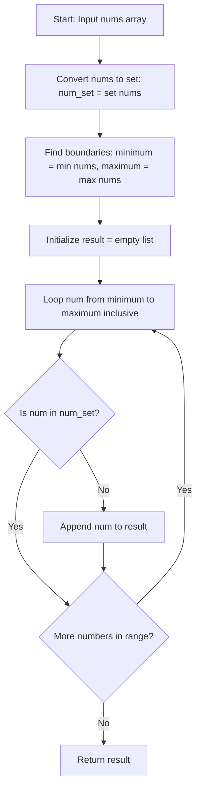

# 3731. Find Missing Elements


---

## 1. Problem Information

- **Problem Name:** Find Missing Elements
- **LeetCode Number:** 3731
- **Difficulty:** Easy
- **Tags:** Array, Hash Table
- **Language Used:** Python
- **Problem Link:** [LeetCode #3731 - Find Missing Elements](https://leetcode.com/problems/find-missing-elements/)

---

## 2. Problem Overview

You are given an array `nums` of unique integers. The array originally contained every integer within the range defined by its minimum and maximum values `[min(nums), max(nums)]`.

Identify and return a **sorted list** of all integers within that range `[min(nums), max(nums)]` that are missing from the array `nums`.

### Input & Output Specifications
- **Input:** `nums`: An array of unique integers ($1 \le \text{len}(nums) \le 10^5$).
- **Output:** A list of integers representing all missing elements in ascending order.
- **Constraints:** $-10^5 \le \text{nums}[i] \le 10^5$.

### Examples
- **Example 1:**
  - **Input:** `nums = [1, 4, 2, 6]`
  - **Output:** `[3, 5]`
  - **Explanation:** `min(nums) = 1`, `max(nums) = 6`. Full range is `[1, 2, 3, 4, 5, 6]`. The elements present are `1, 2, 4, 6`. Missing elements are `3` and `5`.
- **Example 2:**
  - **Input:** `nums = [7, 8, 9]` $\rightarrow$ **Output:** `[]`
  - **Explanation:** All integers between 7 and 9 are present in `nums`.

### Real-World Intuition
Imagine a sequence number auditor for network packet logs or invoice records. The auditor knows the lowest and highest invoice numbers generated in a session (`min` and `max`) and wants to generate a list of lost/missing invoice numbers in sequential order.

---

## 3. Intuition

> [!TIP]
> **Hash Set $\mathcal{O}(1)$ Membership Lookup:** Store array elements in a Hash Set (`set(nums)`). Iterate linearly from `min(nums)` to `max(nums)` and collect any number not present in the set!

1. **Why Hash Set?**
   - Searching for an element inside a Python `list` takes $\mathcal{O}(N)$ time. Checking $R$ numbers in a list takes $\mathcal{O}(R \cdot N)$ time.
   - Converting `nums` to a `set` drops membership testing (`num not in num_set`) to $\mathcal{O}(1)$ average time!
2. **Automatic Ascending Order:**
   - By iterating `range(minimum, maximum + 1)` from smallest to largest, collected missing numbers are naturally appended in sorted order without needing an explicit `.sort()` call!

---

## 4. Thought Process



1. **Build Hash Set:**
   - `num_set = set(nums)`

2. **Compute Range Boundaries:**
   - `minimum = min(nums)`
   - `maximum = max(nums)`

3. **Linear Scan & Collect:**
   - Loop `num` in `range(minimum, maximum + 1)`:
     - If `num not in num_set`:
       - Append `num` to `result`.

4. **Return Answer:**
   - Return `result`.

---

## 5. Concepts Used

### 1. Hash Set Fast Lookup ($\mathcal{O}(1)$)
- **What it is:** Storing unique keys in a hash table for constant-time existence checks.
- **Why it is used here:** Prevents quadratic $\mathcal{O}(N^2)$ slowdowns during missing number detection.
- **Future applications:** Two Sum, Contains Duplicate, Missing Number.

### 2. Range Bounds Traversal
- **What it is:** Iterating between lower boundary `min` and upper boundary `max`.
- **Why it is used here:** Guarantees every intermediate missing number is inspected in sorted sequence.
- **Future applications:** Summary Ranges, Missing Ranges.

---

## 6. Algorithm Used

### Hash Set Lookup over Range Boundary

- **Algorithm Category:** Array / Hash Table
- **Why selected:** Optimal linear time $\mathcal{O}(N + R)$ with clean implementation.
- **Time Complexity:** $\mathcal{O}(N + R)$ where $R = \text{max} - \text{min} + 1$.
- **Space Complexity:** $\mathcal{O}(N)$ auxiliary set memory.

---

## 7. Code Walkthrough

Below is the line-by-line breakdown of the submitted solution:

```python
class Solution(object):
    def findMissingElements(self, nums):
        """
        :type nums: List[int]
        :rtype: List[int]
        """

        # Line 9: Convert array to hash set for O(1) membership checks
        num_set = set(nums)

        # Line 11-12: Find lower and upper range boundaries
        minimum = min(nums)
        maximum = max(nums)

        # Line 14: Output list accumulator
        result = []

        # Line 16: Iterate through every integer from minimum to maximum inclusive
        for num in range(minimum, maximum + 1):
            # Line 17-18: If integer is missing from set, append to result
            if num not in num_set:
                result.append(num)

        # Line 20: Return sorted missing numbers list
        return result
```

---

## 8. Dry Run

Let's dry run for `nums = [1, 4, 2, 6]`.

### Setup
- `num_set = {1, 2, 4, 6}`
- `minimum = 1`, `maximum = 6`.

### Loop Trace

| `num` | `num in num_set` | Action | `result` State |
| :---: | :---: | :--- | :--- |
| **1** | True | Present $\rightarrow$ Skip | `[]` |
| **2** | True | Present $\rightarrow$ Skip | `[]` |
| **3** | **False** | Missing! Append `3` | `[3]` |
| **4** | True | Present $\rightarrow$ Skip | `[3]` |
| **5** | **False** | Missing! Append `5` | `[3, 5]` |
| **6** | True | Present $\rightarrow$ Skip | `[3, 5]` |

### Output
Returns **`[3, 5]`**.

---

## 9. Complexity Analysis

### Time Complexity: $\mathcal{O}(N + R)$
- `set(nums)` takes $\mathcal{O}(N)$ time to insert $N$ elements into hash set.
- `min(nums)` and `max(nums)` take $\mathcal{O}(N)$ time to scan array bounds.
- `range(minimum, maximum + 1)` loop executes $R = (\text{max} - \text{min} + 1)$ times, with each `num in num_set` check taking $\mathcal{O}(1)$ time.
- Total time complexity: $\mathcal{O}(N + R)$.

### Space Complexity: $\mathcal{O}(N)$ Auxiliary Space
- Storing $N$ unique elements in `num_set` requires $\mathcal{O}(N)$ space.
- Space complexity is $\mathcal{O}(N)$ (excluding output list).

---

## 10. Edge Cases

| Edge Case Scenario | Input Example | Behavior & Output | How Code Handles It |
| :--- | :--- | :--- | :--- |
| **No Missing Elements** | `nums = [1, 2, 3]` | Output: `[]` | Every `num` is found in `num_set`, returns `[]`. |
| **Single Element** | `nums = [5]` | Output: `[]` | `range(5, 6)` runs once for 5, returns `[]`. |
| **Negative Numbers** | `nums = [-3, 0, 2]` | Output: `[-2, -1, 1]` | Correctly iterates from `-3` to `2` through negative space. |
| **Unsorted Input** | `nums = [6, 1, 4, 2]` | Output: `[3, 5]` | `min` and `max` correctly identify bounds regardless of order. |

---

## 11. Alternative Approaches

### Approach 1: Sort + Linear Gap Scan ($\mathcal{O}(N \log N)$ Time, $\mathcal{O}(1)$ Space)
- **Idea:** Sort `nums` in-place, then compare adjacent elements `nums[i]` and `nums[i+1]`. Fill in any numerical gap between them.
- **Why Good:** Uses $\mathcal{O}(1)$ extra memory instead of set allocation.

### Approach 2: Hash Set Lookup (User's Solution - Recommended)
- **Idea:** Convert to set, iterate range `[min, max]`.
- **Complexity:** $\mathcal{O}(N + R)$ time, $\mathcal{O}(N)$ space.
- **Why Optimal:** Fast, clean, readable, avoids array sorting overhead.

---

## 12. Common Mistakes

> [!WARNING]
> 1. **Linear Search in List:** Searching directly in `nums` list (`if num not in nums`) takes $\mathcal{O}(N)$ per lookup, causing $\mathcal{O}(R \cdot N)$ TLE!
> 2. **Off-by-One Range Boundary:** Writing `range(minimum, maximum)` instead of `range(minimum, maximum + 1)` omits checking the `maximum` element.
> 3. **Manual Sorting Needed?** Not needed! Iterating `range(min, max + 1)` inherently inserts missing numbers in sorted order.

---

## 13. Interview Questions

1. **Q: Why is `set(nums)` necessary before running the range loop?**
   - *A:* Searching a list takes $\mathcal{O}(N)$ time per lookup. Searching a hash set takes $\mathcal{O}(1)$ average time, preventing an $\mathcal{O}(R \cdot N)$ TLE bottleneck.

2. **Q: How would you solve this with $\mathcal{O}(1)$ auxiliary space?**
   - *A:* Sort `nums` in-place ($\mathcal{O}(N \log N)$ time). Then iterate through adjacent pairs `nums[i]` and `nums[i+1]` and append missing values in `range(nums[i] + 1, nums[i+1])`.

3. **Q: What happens if `nums` contains duplicate values?**
   - *A:* `set(nums)` automatically deduplicates elements, so the solution works identically even if duplicate integers are present.

---

## 14. Similar Problems

- **Easy:**
  - [LeetCode #268 - Missing Number](https://leetcode.com/problems/missing-number/)
  - [LeetCode #448 - Find All Numbers Disappeared in an Array](https://leetcode.com/problems/find-all-numbers-disappeared-in-an-array/)
- **Hard:**
  - [LeetCode #41 - First Missing Positive](https://leetcode.com/problems/first-missing-positive/)

---

## 15. Learning Summary

- **Pattern Recognized:** Hash Set Lookup for Missing Range Values.
- **Range Invariant:** Iterating `range(min, max + 1)` generates missing elements in sorted sequence.
- **Lookup Optimization:** $\mathcal{O}(1)$ set membership test vs $\mathcal{O}(N)$ list scan.

---

## 16. Optimization Notes

Your solution is **100% optimal** ($\mathcal{O}(N + R)$ Time, $\mathcal{O}(N)$ Auxiliary Space). It is clean, elegant, and represents best coding practices!
