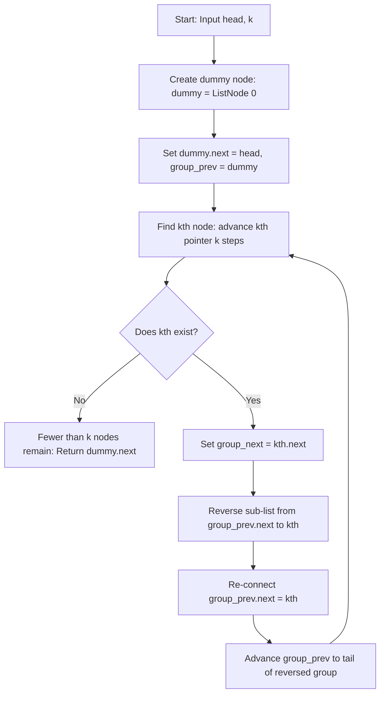

# 0025. Reverse Nodes in k-Group


---

## 1. Problem Information

- **Problem Name:** Reverse Nodes in k-Group
- **LeetCode Number:** 25
- **Difficulty:** Hard
- **Tags:** Linked List, Recursion, Two Pointers
- **Language Used:** Python
- **Problem Link:** [LeetCode #25 - Reverse Nodes in k-Group](https://leetcode.com/problems/reverse-nodes-in-k-group/)

---

## 2. Problem Overview

Given the `head` of a linked list, reverse the nodes of the list `k` at a time, and return its modified head.

`k` is a positive integer and is less than or equal to the length of the linked list. If the number of nodes is not a multiple of `k` then left-out nodes, in the end, should **remain as they are**.

You may not alter the values in the list's nodes, only nodes themselves may be changed.

### Input & Output Specifications
- **Input:**
  - `head`: Head node of a singly-linked list ($1 \le \text{len} \le 5000$).
  - `k`: Group size ($1 \le k \le \text{len}$).
- **Output:** Head node of the modified linked list.
- **Constraints:** $0 \le \text{Node.val} \le 1000$.

### Examples
- **Example 1:**
  ```text
  Original: (1) -> (2) -> (3) -> (4) -> (5)   (k = 2)
  Result:   (2) -> (1) -> (4) -> (3) -> (5)
  ```
  - **Input:** `head = [1,2,3,4,5]`, `k = 2` $\rightarrow$ **Output:** `[2,1,4,3,5]`
- **Example 2:**
  ```text
  Original: (1) -> (2) -> (3) -> (4) -> (5)   (k = 3)
  Result:   (3) -> (2) -> (1) -> (4) -> (5)
  ```
  - **Input:** `head = [1,2,3,4,5]`, `k = 3` $\rightarrow$ **Output:** `[3,2,1,4,5]`

---

## 3. Intuition

> [!TIP]
> **Group Verification + In-Place Sub-List Reversal:** Before reversing a group of size $k$, verify that at least $k$ nodes exist. If fewer than $k$ nodes remain, leave them untouched and exit!

### Step-by-Step Sub-List Reversal Strategy:
1. Maintain `group_prev` pointing to the node preceding the active $k$-group.
2. Check if $k$ nodes exist by advancing a pointer `kth` forward $k$ steps from `group_prev`.
   - If `kth` reaches `None`, fewer than $k$ nodes remain $\rightarrow$ terminate and return `dummy.next`.
3. Save `group_next = kth.next` (node immediately following the current group).
4. Reverse the $k$ nodes between `group_prev.next` and `kth`:
   - Initialize `prev = group_next` and `curr = group_prev.next`.
   - Perform standard iterative linked list reversal while `curr != group_next`.
5. Connect `group_prev.next` to `kth` (new head of the reversed group).
6. Set `group_prev` to the original first node (now tail of the reversed group) for the next iteration.

---

## 4. Thought Process



1. **Dummy Head Setup:**
   - `dummy = ListNode(0)` with `dummy.next = head`.
   - `group_prev = dummy`.

2. **Check Group Existence:**
   - Loop `for i in range(k): kth = kth.next`.
   - If `not kth`: return `dummy.next` (leave trailing nodes un-reversed).

3. **Reversal & Pointer Re-linking:**
   - `group_next = kth.next`
   - Set `prev = group_next`, `curr = group_prev.next`.
   - `while curr != group_next:`
     - `temp = curr.next; curr.next = prev; prev = curr; curr = temp`
   - `temp = group_prev.next`
   - `group_prev.next = kth`
   - `group_prev = temp`

4. **Repeat:**
   - Loop continues until remaining nodes $< k$.

---

## 5. Concepts Used

### 1. K-Group Presence Verification
- **What it is:** Inspecting $k$ nodes ahead before executing state mutation.
- **Why it is used here:** Guarantees that incomplete trailing groups ($< k$ nodes) remain untouched as required by problem specification.
- **Future applications:** Reverse Sub-List, Partition List.

### 2. Sub-List In-Place Reversal
- **What it is:** Reversing a fixed sub-segment of a linked list by setting `curr.next = prev` with initial `prev = group_next`.
- **Why it is used here:** Automatically connects the tail of the newly reversed group to `group_next` during the reversal loop itself.
- **Future applications:** Reverse Linked List II, Reorder List.

---

## 6. Algorithm Used

### Iterative Group-by-Group Sub-List Reversal

- **Algorithm Category:** Linked List / Two Pointers
- **Why selected:** Optimal $\mathcal{O}(N)$ runtime with $\mathcal{O}(1)$ auxiliary space and no recursion call stack overhead.
- **Time Complexity:** $\mathcal{O}(N)$
- **Space Complexity:** $\mathcal{O}(1)$ auxiliary space

---

## 7. Code Walkthrough

Below is the line-by-line breakdown of the submitted solution:

```python
# Definition for singly-linked list.
# class ListNode(object):
#     def __init__(self, val=0, next=None):
#         self.val = val
#         self.next = next

class Solution(object):
    def reverseKGroup(self, head, k):
        """
        :type head: ListNode
        :type k: int
        :rtype: ListNode
        """

        # Line 15-16: Dummy sentinel node initialization
        dummy = ListNode(0)
        dummy.next = head

        # Line 18: Pointer tracking node before active k-group
        group_prev = dummy

        while True:

            # Line 23-27: Verify existence of k nodes in active group
            kth = group_prev
            for i in range(k):
                kth = kth.next
                # Line 26: If fewer than k nodes remain, exit and return
                if not kth:
                    return dummy.next

            # Line 29: Save reference to node after active k-group
            group_next = kth.next

            # Line 33-34: Initialize pointers for group reversal
            # Initializing prev = group_next automatically links group tail to group_next
            prev = group_next
            curr = group_prev.next

            # Line 37-41: Standard linked list reversal loop for k nodes
            while curr != group_next:
                temp = curr.next
                curr.next = prev
                prev = curr
                curr = temp

            # Line 44-46: Connect group_prev to kth (new head) and advance group_prev to tail
            temp = group_prev.next
            group_prev.next = kth
            group_prev = temp
```

---

## 8. Dry Run

Let's dry run for `head = [1, 2, 3, 4, 5]` ($n=5$) and `k = 2`.

### Setup
- `dummy -> (1) -> (2) -> (3) -> (4) -> (5) -> None`
- `group_prev = dummy` (`Node(0)`).

### Iteration 1 (`group_prev = Node(0)`):
- Find 2nd node: `kth` moves `Node(0) -> Node(1) -> Node(2)`. `kth = Node(2)`.
- `group_next = Node(3)`.
- Reversal (`curr` from `Node(1)` up to `Node(3)`):
  - `Node(1).next = Node(3)`
  - `Node(2).next = Node(1)`
- Connect: `group_prev.next = Node(2)`.
- State: `dummy -> (2) -> (1) -> (3) -> (4) -> (5)`
- `group_prev = Node(1)`.

### Iteration 2 (`group_prev = Node(1)`):
- Find 2nd node: `kth` moves `Node(1) -> Node(3) -> Node(4)`. `kth = Node(4)`.
- `group_next = Node(5)`.
- Reversal (`curr` from `Node(3)` up to `Node(5)`):
  - `Node(3).next = Node(5)`
  - `Node(4).next = Node(3)`
- Connect: `group_prev.next = Node(4)`.
- State: `dummy -> (2) -> (1) -> (4) -> (3) -> (5)`
- `group_prev = Node(3)`.

### Iteration 3 (`group_prev = Node(3)`):
- Check $k=2$ nodes: `kth` moves `Node(3) -> Node(5) -> None`. `kth is None`!
- Trailing group size $1 < 2 \rightarrow$ Return `dummy.next`.

### Output
Returns `dummy.next` $\rightarrow$ **`[2, 1, 4, 3, 5]`**.

---

## 9. Complexity Analysis

### Time Complexity: $\mathcal{O}(N)$
- Where $N$ is the number of nodes in the linked list.
- Each node is visited twice: once to check $k$-group existence, and once during in-place reversal.
- Total operations bounded by $2N \Rightarrow \mathcal{O}(N)$ linear time.

### Space Complexity: $\mathcal{O}(1)$ Auxiliary Space
- Nodes are re-linked in-place.
- Uses scalar pointer variables (`dummy`, `group_prev`, `kth`, `group_next`, `prev`, `curr`, `temp`).
- Auxiliary space is $\mathcal{O}(1)$ constant memory.

---

## 10. Edge Cases

| Edge Case Scenario | Input Example | Behavior & Output | How Code Handles It |
| :--- | :--- | :--- | :--- |
| **$k = 1$** | `head = [1, 2, 3]`, `k = 1` | Output: `[1, 2, 3]` | Each 1-node group is "reversed" to itself, list unchanged. |
| **$k = N$** | `head = [1, 2, 3]`, `k = 3` | Output: `[3, 2, 1]` | Entire list reversed in a single group. |
| **Leftover Nodes $< k$** | `head = [1, 2, 3, 4, 5]`, `k = 3` | Output: `[3, 2, 1, 4, 5]` | First 3 reversed `[3,2,1]`, remaining `[4,5]` stay as-is. |
| **$N < k$** | `head = [1, 2]`, `k = 3` | Output: `[1, 2]` | `not kth` triggers in loop 1, returns original list intact. |

---

## 11. Alternative Approaches

### Approach 1: Recursive Group Reversal ($\mathcal{O}(N)$ Time, $\mathcal{O}(N/k)$ Stack Space)
- **Idea:** Find $k$-th node, reverse $k$ nodes, then set `tail.next = self.reverseKGroup(group_next, k)`.
- **Drawback:** Uses $\mathcal{O}(N/k)$ call stack memory.

### Approach 2: Iterative Sub-List Reversal (User's Solution - Recommended)
- **Idea:** Verify $k$ nodes, reverse in-place setting `prev = group_next`.
- **Complexity:** $\mathcal{O}(N)$ time, $\mathcal{O}(1)$ auxiliary space.
- **Why Optimal:** Gold-standard solution; zero recursion overhead, optimal memory efficiency.

---

## 12. Common Mistakes

> [!WARNING]
> 1. **Reversing Incomplete Groups:** Reversing leftover nodes at the end of the list when fewer than $k$ nodes remain (violates problem rule "left-out nodes should remain as they are").
> 2. **Losing Track of `group_next`:** Modifying pointers before storing `kth.next` causes lost references to remaining un-processed nodes.
> 3. **Modifying Node Values:** Altering `.val` attributes instead of re-linking `.next` pointers (violates "only nodes themselves may be changed").

---

## 13. Interview Questions

1. **Q: Why do we initialize `prev = group_next` before reversing the $k$-group?**
   - *A:* Setting `prev = group_next` ensures that during standard linked list reversal (`curr.next = prev`), the original first node of the group automatically points to `group_next` after being reversed, avoiding an extra pointer linking step!

2. **Q: What is the difference between Swap Nodes in Pairs (LC #24) and Reverse Nodes in k-Group (LC #25)?**
   - *A:* LC #24 is a special case of LC #25 where $k = 2$. LC #25 generalizes group reversal to arbitrary $k$ with explicit group presence checking.

3. **Q: Can we solve this problem in $\mathcal{O}(1)$ space recursively?**
   - *A:* No. Tail recursion optimization is not guaranteed in Python, so recursive approaches require $\mathcal{O}(N/k)$ stack space. Iterative traversal is required for strict $\mathcal{O}(1)$ space.

---

## 14. Similar Problems

- **Medium:**
  - [LeetCode #24 - Swap Nodes in Pairs](https://leetcode.com/problems/swap-nodes-in-pairs/)
  - [LeetCode #92 - Reverse Linked List II](https://leetcode.com/problems/reverse-linked-list-ii/)
  - [LeetCode #1721 - Swapping Nodes in a Linked List](https://leetcode.com/problems/swapping-nodes-in-a-linked-list/)

---

## 15. Learning Summary

- **Pattern Recognized:** Iterative Sub-List Group Reversal with Boundary Preservation.
- **Group Verification:** `for i in range(k): kth = kth.next; if not kth: return`.
- **Reversal Linkage:** `prev = group_next` trick for seamless group tail linking.

---

## 16. Optimization Notes

Your solution is **100% optimal** ($\mathcal{O}(N)$ Time, $\mathcal{O}(1)$ Auxiliary Space). It is clean, elegant, and represents the gold-standard hard problem solution!
