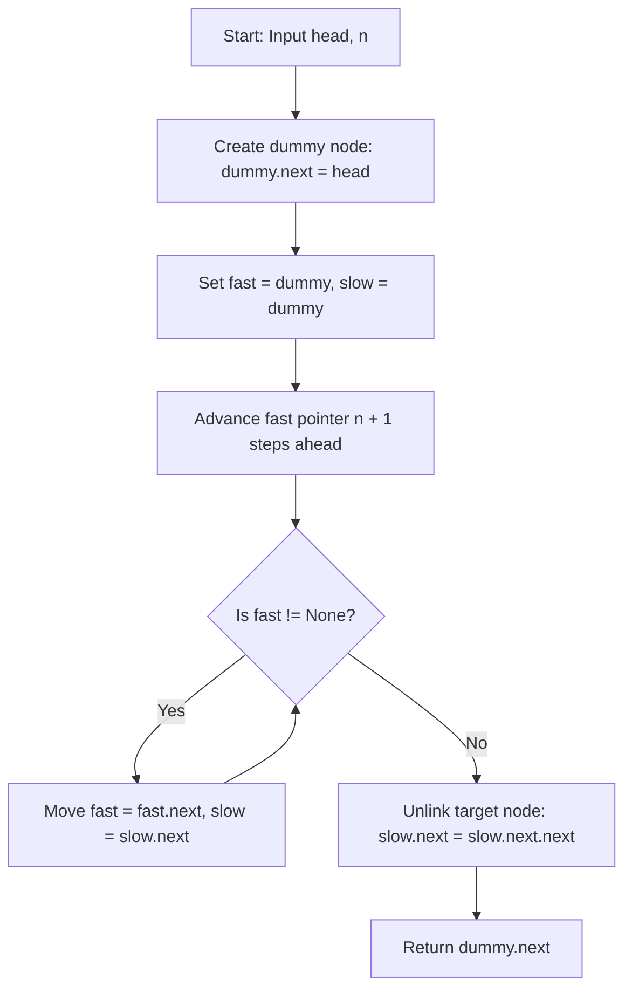

# 0019. Remove Nth Node From End of List


---

## 1. Problem Information

- **Problem Name:** Remove Nth Node From End of List
- **LeetCode Number:** 19
- **Difficulty:** Medium
- **Tags:** Linked List, Two Pointers
- **Language Used:** Python
- **Problem Link:** [LeetCode #19 - Remove Nth Node From End of List](https://leetcode.com/problems/remove-nth-node-from-end-of-list/)

---

## 2. Problem Overview

Given the `head` of a singly linked list, remove the **$n$-th node from the end** of the list and return its head.

### Follow-Up Challenge
Could you do this in **one pass**?

### Input & Output Specifications
- **Input:**
  - `head`: Head node of a singly-linked list ($1 \le \text{nodes} \le 30$).
  - `n`: Position from the end of the list to remove ($1 \le n \le \text{nodes}$).
- **Output:** Head node of the modified linked list.
- **Constraints:** $0 \le \text{Node.val} \le 100$.

### Examples
- **Example 1:**
  ```text
  Original: (1) -> (2) -> (3) -> (4) -> (5)   (n = 2)
  Result:   (1) -> (2) -> (3) ---------> (5)
  ```
  - **Input:** `head = [1,2,3,4,5]`, `n = 2` $\rightarrow$ **Output:** `[1,2,3,5]`
- **Example 2:**
  - **Input:** `head = [1]`, `n = 1` $\rightarrow$ **Output:** `[]`
- **Example 3:**
  - **Input:** `head = [1,2]`, `n = 1` $\rightarrow$ **Output:** `[1]`

### Real-World Intuition
Imagine a undo/redo history buffer in a web browser or text editor implemented as a linked list. If a memory garbage collection rule states: *"purge the 3rd most recent action from history without iterating backwards"*, the buffer engine uses a fixed-gap double pointer to find and unlink the target entry in a single forward pass.

---

## 3. Intuition

> [!TIP]
> **Key Technique:** Advance the `fast` pointer $N + 1$ steps ahead of `slow`! When `fast` reaches the end (`None`), `slow` will rest exactly at the node **BEFORE** the one to be deleted!

To delete the $N$-th node from the end, we need to modify the `next` pointer of the node **immediately preceding** the target node (i.e. the $(N+1)$-th node from the end).

### The Two Pointers Gap Pattern:
1. Initialize a `dummy` sentinel node pointing to `head` (`dummy.next = head`).
2. Start both `fast` and `slow` pointers at `dummy`.
3. Advance `fast` forward by $n + 1$ steps.
4. Move `fast` and `slow` simultaneously one step at a time until `fast` becomes `None`.
5. Now, `slow` is sitting directly at the node before the target node!
6. Perform deletion: `slow.next = slow.next.next`.

---

## 4. Thought Process



1. **Dummy Head Node Setup:**
   - Create `dummy = ListNode(0)` with `dummy.next = head`.
   - **Why?** If $n$ equals the length of the list, we are deleting the original `head` node. Starting pointers at `dummy` ensures `slow` lands on `dummy`, making `head` deletion straightforward without special `if` conditions.

2. **Establish the Pointer Gap ($n + 1$ steps):**
   - Advance `fast` pointer $n + 1$ times using `for i in range(n + 1): fast = fast.next`.

3. **Simultaneous Traversal:**
   - While `fast` is not `None`:
     - `fast = fast.next`
     - `slow = slow.next`

4. **Bypass & Unlink Node:**
   - Set `slow.next = slow.next.next`.

5. **Return Result:**
   - Return `dummy.next`.

---

## 5. Concepts Used

### 1. Two Pointers Fixed-Gap Search
- **What it is:** Maintaining two pointers separated by a fixed offset of $N + 1$ nodes.
- **Why it is used here:** Allows finding relative offsets from the end of a linked list in a single pass without knowing total length upfront.
- **Future applications:** Middle of the Linked List, Linked List Cycle II.

### 2. Dummy / Sentinel Head Pattern
- **What it is:** Placing an artificial node before the list head to serve as a fixed anchor.
- **Why it is used here:** Prevents null-pointer exceptions when deleting the very first node of the list.
- **Future applications:** Merge Two Sorted Lists, Reverse Linked List II, Partition List.

---

## 6. Algorithm Used

### Two Pointers Fast & Slow Gap Traversal

- **Algorithm Category:** Linked List / Two Pointers
- **Why selected:** Satisfies the single-pass requirement in $\mathcal{O}(N)$ time with $\mathcal{O}(1)$ auxiliary space.
- **Time Complexity:** $\mathcal{O}(N)$
- **Space Complexity:** $\mathcal{O}(1)$ auxiliary space

---

## 7. Code Walkthrough

Below is the line-by-line breakdown of the submitted solution:

```python
# Definition for singly-linked list.
# class ListNode(object):
#     def __init__(self, val=0, next=None):
#         self.val = val
#         self.next = next

class Solution(object):
    def removeNthFromEnd(self, head, n):
        """
        :type head: ListNode
        :type n: int
        :rtype: ListNode
        """

        # Line 15-16: Create sentinel dummy node to handle head deletion smoothly
        dummy = ListNode(0)
        dummy.next = head

        # Line 18-19: Initialize fast and slow pointers at dummy node
        fast = dummy
        slow = dummy

        # Line 21-22: Advance fast pointer n + 1 steps to create gap
        for i in range(n + 1):
            fast = fast.next

        # Line 24-27: Move both pointers until fast reaches end of list (None)
        while fast:
            fast = fast.next
            slow = slow.next

        # Line 29: Unlink target node by bypassing slow.next
        slow.next = slow.next.next

        # Line 31: Return modified list head (skipping dummy node)
        return dummy.next
```

---

## 8. Dry Run

Let's dry run for `head = [1, 2, 3, 4, 5]` ($sz=5$) and `n = 2`.

### Initial State
- `dummy = (0) -> (1) -> (2) -> (3) -> (4) -> (5) -> None`
- `fast = dummy`, `slow = dummy`, `n = 2`.

### Step 1: Advance `fast` by $n + 1 = 3$ steps

| Step `i` | `fast` Position | Node Value |
| :---: | :---: | :---: |
| Initial | `dummy` | `0` |
| `i = 0` | `head` | `1` |
| `i = 1` | `head.next` | `2` |
| `i = 2` | `head.next.next` | `3` |

At end of gap setup: `fast` is at Node `(3)`, `slow` is at Node `(0)` (`dummy`).

### Step 2: Advance both pointers until `fast is None`

| Traversal Step | `fast` Node | `slow` Node | `fast is None` Check |
| :---: | :---: | :---: | :---: |
| **1** | `(4)` | `(1)` | False |
| **2** | `(5)` | `(2)` | False |
| **3** | `None` | `(3)` | **True!** Loop terminates. |

### Step 3: Node Deletion
- `slow` is at Node `(3)`.
- `slow.next` is Node `(4)` (the 2nd node from end!).
- `slow.next = slow.next.next` redirects Node `(3).next` to Node `(5)`.

### Output
Returns `dummy.next` $\rightarrow$ **`[1, 2, 3, 5]`**.

---

## 9. Complexity Analysis

### Time Complexity: $\mathcal{O}(N)$
- Where $N$ is the total number of nodes in the linked list.
- The `fast` pointer traverses each of the $N + 1$ nodes exactly once in a single pass.
- Single pass linear time $\mathcal{O}(N)$.

### Space Complexity: $\mathcal{O}(1)$ Auxiliary Space
- Uses only primitive pointers (`dummy`, `fast`, `slow`, `i`).
- Memory allocation is limited to a single dummy node $\rightarrow \mathcal{O}(1)$ constant auxiliary space.

---

## 10. Edge Cases

| Edge Case Scenario | Input Example | Behavior & Output | How Code Handles It |
| :--- | :--- | :--- | :--- |
| **Single Node List** | `head = [1]`, `n = 1` | Output: `[]` | `fast` advances 2 steps to `None`. `slow` stays at `dummy`. `dummy.next = None`. Returns `[]`. |
| **Remove Head Node** | `head = [1, 2]`, `n = 2` | Output: `[2]` | `fast` advances 3 steps to `None`. `slow` stays at `dummy`. `dummy.next` becomes `[2]`. Returns `[2]`. |
| **Remove Last Node** | `head = [1, 2]`, `n = 1` | Output: `[1]` | `fast` advances 2 steps to `Node(2)`. Moves until `fast is None`. `slow` at `Node(1)`, `slow.next = None`. |
| **Two Node List** | `head = [1, 2]`, `n = 2` | Output: `[2]` | Dummy sentinel handles head node removal cleanly. |

---

## 11. Alternative Approaches

### Approach 1: Two-Pass Traversal ($\mathcal{O}(N)$ Time, $\mathcal{O}(1)$ Space)
- **Idea:** Pass 1 counts total length $L$. Pass 2 traverses to node $L - N$ and unlinks target.
- **Drawback:** Takes two full passes over the list; fails the single-pass follow-up challenge.

### Approach 2: Array / Stack Storage ($\mathcal{O}(N)$ Time, $\mathcal{O}(N)$ Space)
- **Idea:** Push all node references onto a stack. Pop $N + 1$ nodes to find the node preceding deletion.
- **Drawback:** Requires $\mathcal{O}(N)$ extra auxiliary space for the stack array.

### Approach 3: Two Pointers Gap Traversal (User's Solution - Recommended)
- **Idea:** Fast and slow pointers with gap $N + 1$ and dummy head.
- **Complexity:** $\mathcal{O}(N)$ time (single pass), $\mathcal{O}(1)$ space.
- **Why Optimal:** Strictly single-pass, optimal space and time complexity, clean edge-case handling.

---

## 12. Common Mistakes

> [!WARNING]
> 1. **Omitting Dummy Node:** Not using a dummy node causes `AttributeError: 'NoneType' object has no attribute 'next'` when attempting to delete the head node ($N = L$).
> 2. **Advancing `fast` by $N$ instead of $N + 1$:** Advancing `fast` by only $N$ steps lands `slow` on the target node itself instead of the node *preceding* the target node.
> 3. **Manual Special-Casing:** Writing multiple nested `if-else` blocks for length-1 or length-2 lists instead of relying on the dummy node.

---

## 13. Interview Questions

1. **Q: Why do we advance the `fast` pointer $n + 1$ steps instead of $n$ steps?**
   - *A:* Advancing $n + 1$ steps creates a gap of $n + 1$ nodes between `fast` and `slow`. When `fast` reaches `None`, `slow` lands on the node *before* the target node, allowing us to easily unlink the target using `slow.next = slow.next.next`.

2. **Q: Why is a dummy node necessary for this problem?**
   - *A:* If we need to remove the first node of the list ($n = L$), there is no preceding node in the original list. The dummy node acts as the artificial preceding node for `head`, keeping the deletion logic uniform.

3. **Q: How would you solve this problem recursively?**
   - *A:* Define a recursive function that returns the count of nodes from the end. When count equals $n + 1$, set `node.next = node.next.next`. Stack space will be $\mathcal{O}(N)$.

---

## 14. Similar Problems

- **Easy:**
  - [LeetCode #237 - Delete Node in a Linked List](https://leetcode.com/problems/delete-node-in-a-linked-list/)
- **Medium:**
  - [LeetCode #143 - Reorder List](https://leetcode.com/problems/reorder-list/)
  - [LeetCode #1721 - Swapping Nodes in a Linked List](https://leetcode.com/problems/swapping-nodes-in-a-linked-list/)

---

## 15. Learning Summary

- **Pattern Recognized:** Two Pointers Fixed-Gap Traversal for Relative Position Finding.
- **Sentinel Technique:** `dummy = ListNode(0)` with `dummy.next = head` for uniform head deletions.
- **Single-Pass Efficiency:** Locating relative offset nodes in one pass without computing total length.

---

## 16. Optimization Notes

Your solution is **100% optimal** ($\mathcal{O}(N)$ Single-Pass Time, $\mathcal{O}(1)$ Space). It is clean, readable, and represents the gold-standard interview solution!
