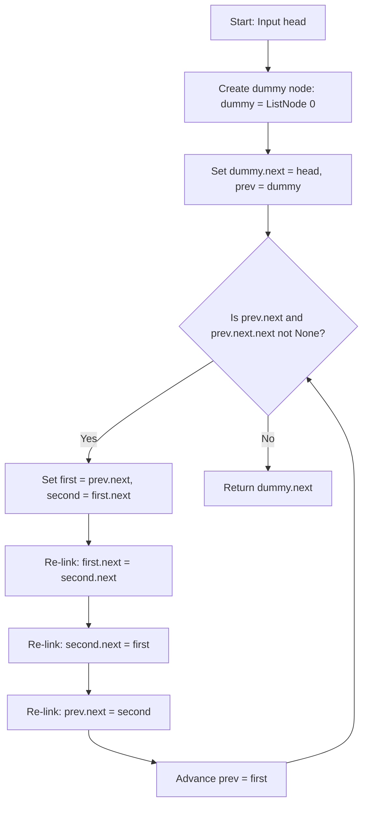

# 0024. Swap Nodes in Pairs


---

## 1. Problem Information

- **Problem Name:** Swap Nodes in Pairs
- **LeetCode Number:** 24
- **Difficulty:** Medium
- **Tags:** Linked List, Recursion, Two Pointers
- **Language Used:** Python
- **Problem Link:** [LeetCode #24 - Swap Nodes in Pairs](https://leetcode.com/problems/swap-nodes-in-pairs/)

---

## 2. Problem Overview

Given a singly linked list, swap every two adjacent nodes and return its head.

You must solve the problem without modifying the values in the list's nodes (i.e., **only nodes themselves may be changed**).

### Input & Output Specifications
- **Input:** `head`: Head node of a singly-linked list ($0 \le \text{len} \le 100$).
- **Output:** Head node of the pairwise-swapped linked list.
- **Constraints:** $0 \le \text{Node.val} \le 100$.

### Examples
- **Example 1:**
  ```text
  Original: (1) -> (2) -> (3) -> (4)
  Result:   (2) -> (1) -> (4) -> (3)
  ```
  - **Input:** `head = [1,2,3,4]` $\rightarrow$ **Output:** `[2,1,4,3]`
- **Example 2:**
  - **Input:** `head = []` $\rightarrow$ **Output:** `[]`
- **Example 3:**
  - **Input:** `head = [1]` $\rightarrow$ **Output:** `[1]`

### Real-World Intuition
Imagine a memory paging controller or task scheduler organizing pairwise execution threads. If a priority rule dictates: *"swap adjacent job pairs to interleave resource allocation"*, the scheduler re-links thread pointers in-place without re-allocating task memory objects.

---

## 3. Intuition

> [!TIP]
> **3-Step Pointer Re-linking:** Use a `dummy` node and a `prev` pointer to track the node before each pair. Re-link `first.next`, `second.next`, and `prev.next` in-place!

### How Pairwise Swapping Works:
For a pair of nodes `first` and `second` preceded by `prev`:
1. `first.next = second.next`: Point `first` to the rest of the list (start of next pair).
2. `second.next = first`: Point `second` back to `first` (reversing their order).
3. `prev.next = second`: Connect `prev` to `second` (new head of swapped pair).
4. `prev = first`: Advance `prev` to `first` (which is now the second node in the pair) to prepare for the next iteration!

```text
Before:  prev -> (1: first) -> (2: second) -> (3)
Step 1:  (1: first) ------------------------> (3)
Step 2:  (2: second) -> (1: first) ---------> (3)
Step 3:  prev -> (2: second) -> (1: first) -> (3)
Step 4:  prev moves to (1: first)
```

---

## 4. Thought Process



1. **Dummy Head Setup:**
   - `dummy = ListNode(0)` with `dummy.next = head`.
   - `prev = dummy`.

2. **Traversal Condition:**
   - Loop `while prev.next and prev.next.next:` (ensures a complete pair exists to swap).

3. **In-Place Pointer Swap:**
   - `first = prev.next`
   - `second = first.next`
   - `first.next = second.next`
   - `second.next = first`
   - `prev.next = second`

4. **Advance Pointer:**
   - `prev = first`

5. **Return Result:**
   - Return `dummy.next`.

---

## 5. Concepts Used

### 1. In-Place Pointer Manipulation
- **What it is:** Modifying node pointer references (`.next`) directly without creating new list nodes or altering node values.
- **Why it is used here:** Satisfies strict problem constraints requiring node pointer mutations in $\mathcal{O}(1)$ space.
- **Future applications:** Reverse Linked List II, Reverse Nodes in k-Group, Rotate List.

### 2. Sentinel / Dummy Head Pattern
- **What it is:** Using an artificial starting node as a fixed anchor before `head`.
- **Why it is used here:** Eliminates edge-case checks when updating `head` during the first pair swap.
- **Future applications:** Merge Two Sorted Lists, Remove Nth Node From End.

---

## 6. Algorithm Used

### Iterative In-Place Pair Swapping

- **Algorithm Category:** Linked List / Two Pointers
- **Why selected:** Optimal $\mathcal{O}(N)$ runtime with $\mathcal{O}(1)$ auxiliary space and no recursion stack overhead.
- **Time Complexity:** $\mathcal{O}(N)$
- **Space Complexity:** $\mathcal{O}(1)$ auxiliary space

---

## 7. Code Walkthrough

Below is the line-by-line breakdown of the submitted solution:

```python
# Definition for singly-linked list.
# class ListNode(object):
#     def __init__(self, val=0, next=None):
#         self.val = val
#         self.next = next

class Solution(object):
    def swapPairs(self, head):
        """
        :type head: ListNode
        :rtype: ListNode
        """

        # Line 15-16: Initialize dummy sentinel node and point to head
        dummy = ListNode(0)
        dummy.next = head

        # Line 18: Pointer to track node preceding active pair
        prev = dummy

        # Line 20: Loop while at least 2 nodes remain in current pair
        while prev.next and prev.next.next:

            # Line 22-23: Identify pair nodes
            first = prev.next
            second = first.next

            # Line 26: Step 1 - Connect first node to rest of list
            first.next = second.next

            # Line 27: Step 2 - Point second node back to first node
            second.next = first

            # Line 28: Step 3 - Connect prev pointer to second node
            prev.next = second

            # Line 31: Move prev pointer forward to end of swapped pair
            prev = first

        # Line 33: Return head of swapped list (skipping dummy sentinel)
        return dummy.next
```

---

## 8. Dry Run

Let's dry run for `head = [1, 2, 3, 4]`.

### Setup
- `dummy = (0) -> (1) -> (2) -> (3) -> (4) -> None`
- `prev = dummy` (`Node(0)`).

### Iteration 1 (`prev = Node(0)`):
- `first = Node(1)`, `second = Node(2)`.
- `first.next = second.next` $\rightarrow$ `Node(1).next = Node(3)`.
- `second.next = first` $\rightarrow$ `Node(2).next = Node(1)`.
- `prev.next = second` $\rightarrow$ `Node(0).next = Node(2)`.
- State: `dummy -> (2) -> (1) -> (3) -> (4)`
- `prev = first` $\rightarrow$ `prev = Node(1)`.

### Iteration 2 (`prev = Node(1)`):
- `first = Node(3)`, `second = Node(4)`.
- `first.next = second.next` $\rightarrow$ `Node(3).next = None`.
- `second.next = first` $\rightarrow$ `Node(4).next = Node(3)`.
- `prev.next = second` $\rightarrow$ `Node(1).next = Node(4)`.
- State: `dummy -> (2) -> (1) -> (4) -> (3) -> None`
- `prev = first` $\rightarrow$ `prev = Node(3)`.

### Loop Termination
- `prev.next` is `None` $\rightarrow$ Loop ends.

### Output
Returns `dummy.next` $\rightarrow$ **`[2, 1, 4, 3]`**.

---

## 9. Complexity Analysis

### Time Complexity: $\mathcal{O}(N)$
- Where $N$ is the number of nodes in the linked list.
- We iterate through pairs of nodes, processing $N/2$ pairs.
- Each pair swap executes in $\mathcal{O}(1)$ time.
- Total time complexity is strictly linear $\mathcal{O}(N)$.

### Space Complexity: $\mathcal{O}(1)$ Auxiliary Space
- Nodes are re-linked in-place.
- Uses only 4 pointer variables (`dummy`, `prev`, `first`, `second`).
- Auxiliary memory is $\mathcal{O}(1)$ constant space.

---

## 10. Edge Cases

| Edge Case Scenario | Input Example | Behavior & Output | How Code Handles It |
| :--- | :--- | :--- | :--- |
| **Empty List** | `head = []` | Output: `[]` | `while prev.next` fails immediately, returns `dummy.next` (`None`). |
| **Single Element** | `head = [1]` | Output: `[1]` | `while prev.next.next` fails immediately, returns `[1]`. |
| **Odd Length List** | `head = [1, 2, 3]` | Output: `[2, 1, 3]` | Swaps first pair `[1, 2]`. Loop terminates for node `[3]`, leaving it un-swapped. |
| **Two Element List** | `head = [1, 2]` | Output: `[2, 1]` | Swaps single pair `[1, 2]` cleanly. |

---

## 11. Alternative Approaches

### Approach 1: Recursive Pair Swapping ($\mathcal{O}(N)$ Time, $\mathcal{O}(N)$ Stack Space)
- **Idea:** Recursively swap first pair, then set `first.next = swapPairs(second.next)`.
  ```python
  if not head or not head.next:
      return head
  first, second = head, head.next
  first.next = self.swapPairs(second.next)
  second.next = first
  return second
  ```
- **Drawback:** Requires $\mathcal{O}(N)$ call stack memory overhead.

### Approach 2: Iterative Pair Swapping (User's Solution - Recommended)
- **Idea:** 3-step pointer re-linking using sentinel dummy node.
- **Complexity:** $\mathcal{O}(N)$ time, $\mathcal{O}(1)$ space.
- **Why Optimal:** Standard interview blueprint; optimal time and space with zero call stack overhead.

---

## 12. Common Mistakes

> [!WARNING]
> 1. **Modifying Node Values:** Writing `first.val, second.val = second.val, first.val` violates problem constraint *"only nodes themselves may be changed"*.
> 2. **Losing Reference to Remaining List:** Re-linking `second.next = first` before saving `second.next` loses the reference to `node 3`.
> 3. **Forgetting to Advance `prev`:** Omitting `prev = first` causes an infinite loop.

---

## 13. Interview Questions

1. **Q: Why must we use a dummy node for this problem?**
   - *A:* Because swapping the first pair changes the head of the list from `head` to `head.next`. The dummy node serves as an anchor so `dummy.next` automatically points to the new head (`second`).

2. **Q: How does this problem generalize to reversing nodes in groups of $K$ (LeetCode #25)?**
   - *A:* Swap Pairs is a special case of Reverse Nodes in $k$-Group where $k = 2$. For arbitrary $k$, we count $k$ nodes, reverse the sub-list of size $k$, and connect `prev.next` to the new group head.

3. **Q: Can we swap values instead of nodes in Python?**
   - *A:* While modifying `.val` is easier, interviewers prohibit it because real-world nodes may contain complex objects/payloads where value copies are expensive or impossible.

---

## 14. Similar Problems

- **Easy:**
  - [LeetCode #206 - Reverse Linked List](https://leetcode.com/problems/reverse-linked-list/)
- **Medium:**
  - [LeetCode #1721 - Swapping Nodes in a Linked List](https://leetcode.com/problems/swapping-nodes-in-a-linked-list/)
- **Hard:**
  - [LeetCode #25 - Reverse Nodes in k-Group](https://leetcode.com/problems/reverse-nodes-in-k-group/)

---

## 15. Learning Summary

- **Pattern Recognized:** Iterative In-Place Linked List Pointer Re-linking.
- **Pointer Swap Invariant:** 3-step re-link sequence (`first.next`, `second.next`, `prev.next`).
- **Sentinel Technique:** `dummy = ListNode(0)` with `dummy.next = head` for uniform head manipulation.

---

## 16. Optimization Notes

Your solution is **100% optimal** ($\mathcal{O}(N)$ Time, $\mathcal{O}(1)$ Auxiliary Space). It is clean, elegant, and represents the gold-standard interview implementation!
